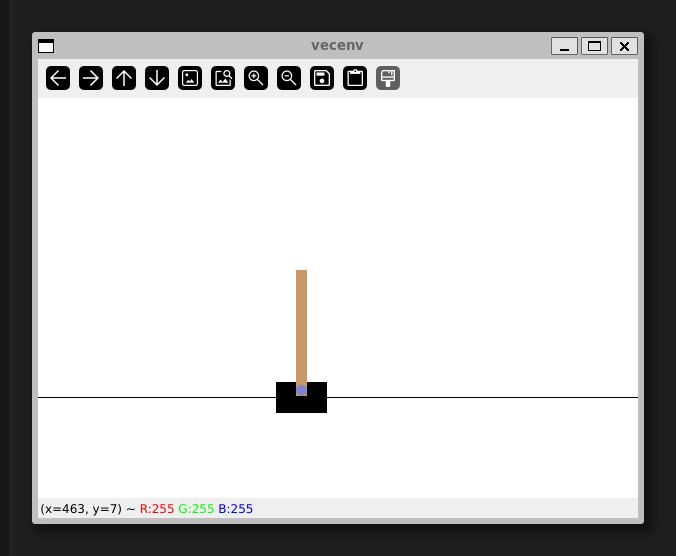

# sb3-trial

Stable Baselines 3 Cartpole example configured with Rye as dependency manager.
Tested with Ubuntu on WSL2.

## Prerequisites
* At a type `make devinstall` to set up the project-level dependencies in development mode, or just `make install` to set up the game as runnable only.

## To run the example
* At a command prompt in the project directory, type `make run`.

## Notes for Visual Studio Code users
* I've included some extension recommendations that can make your development easier.
  * [Run On Save](https://marketplace.visualstudio.com/items?itemName=emeraldwalk.RunOnSave)
  * [Make support and task provider](https://marketplace.visualstudio.com/items?itemName=carlos-algms.make-task-provider)
* These recommendations will pop up when opening the project inside VSCode.
* Installing both extensions will
  * Use the code in `settings.json` to run `make format` and `make lint` on each `File:Save`.
  * Display available Make targets within the _Makefile Tasks_ sidebar pane and allow them to be run with a mouse click.
